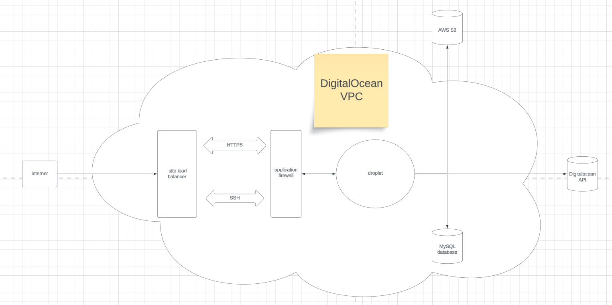

# context 📝

- this online music player is a web application built to share my music with audiophiles, while showcasing my overall technical know-how to other curious techies.

## UPDATE MARCH 27, 2025

- NOTE: I started this project a few years ago but have now retroactively come back to write up this Readme

## goal ⚽️ 🥅

- My goal was to pick Javascript back up and learn a framework to learn how to build a reactive, modern web app client.
- I used to strictly classify myself as a Backend Software engineer. In my folly, I thought that the frontend was going to be "too easy", so there was no point in learning about building client applications. But in order to build a platform to share my music on, I needed to finally venture into the frontend

## deployment ☁️

- as a note here, deployment strategies were never in my bucket of concerns when building getmybeats.com, which is another way of me saying that my deployment strategy is still not that great 😓

### current ✅

- via command line or Postman, I just call DigitalOcean's `Create a New Droplet` API endpoint, simply updating the environment variables within the request body as each-release requires.
  - this spawns a new Droplet which is able to install all bootstrapping software, packages, and necessary deployment files, thanks to the cloud init metadata included in the request payload.
  - once the codebase is downloaded and the release branch is checked out, the Droplet installs the site's SSL certificates, bundles the frontend Angular app, starts the Django app
  - the Django app then adds the Droplet that it's currently running on to the load balancer and firewall, removing the previous Droplet / instance from the load balancer and firewall... [see all of my wonky design decisions] (#wonky-design-decisions)
  - The Droplet then starts all other services and finally spawns a master Nginx process.

### previous 🚫

- before I knew a thing about CI/CD, I would manually log into my servers, check out a release commit, then restart all services/processes. this was a nightmare, as you could imagine 😫

## infrastructure

- for simplicity, here's a nifty infrastructural overlook of `getmybeats.com`. It's not too complex of a system: as you can see, I've load balanced and firewalled it; from there, the Ubuntu Droplet makes outbound AWS, database, and DigitalOcean API calls
- 

## tech stack 🥞

- At the time I was trying to save as much money as possible, and having deployed my infrastructure to AWS bare metal, the cost was high. For this reason, I decided to migrate to DigitalOcean and consolidate both client and server side apps to the same Droplet
- Here's an overview of what happens when a browser requests `getmybeats.com`
  - The Nginx proxies the request to the Gunicorn web server gateway interface
  - Gunicorn passes the request to the Django application
  - Django responds with an HTML template, which contains a script pointing to the bundled Angular frontend
  - the browser loads the document and voilà, the music player the user can begin listening to my music

### api 📟

- I built this backend in Python using the Django Rest Framework
- The backend's responsibilities/tasks include but are not limited to:
  - run dedicated cron tasks for regular system pruning and upkeep
  - host an admin interface to neatly and safely manage database tables/records (comes out-of-box in a Django application)
  - download and upload audio files, deployment files, configuration files to an AWS S3 bucket
  - automatically download existing SSL certificates during a deployment or to automatically renew SSL certificates when they expire
  - run all database migrations during a deployment
  - stream audio files to the client requesting them
  - validate that the audio stream request came from a browser running the bundled frontend (I have a few tricks up my sleeve to ensure this so that people cannot simply call the API to download my songs)
  - serving a `user experience report` template that outlines known bugs and upcoming bug fixes and features

### client application v1 🧑‍💻

- The very first iteration of the `getmybeats.com` frontend was built purely in Javascript, HTML, and CSS. I knew this was not a sustainable route, but I rushed to get my music out onto the interwebs.
During this time, I struggled a lot with understanding Javascript's capabilities and limitations regarding playing audio in the browser.
- What haunted me, and still haunts me to this day, is how finicky the Audio API is between different browsers. Dont' get me started on how and when it expects specific headers to be present on certain HTTP requests, and the side effects of these headers not being present 👻
- in this iteration, the Django app embedded each audio file into the HTML document, allowing people to effectively steal my songs if they wanted to 🥷

### client application v2 👨‍💻

- Admittedly, 90% of the second iteration of the `getmybeats.com` frontend was borrowed from code I found somewhere on the internet because I had a lot of trouble with Javascript's audio playback abilities.
- This code was basically a fully fleshed out React App, which meant that I had to learn React. I had to refactor most of this code to get the project to compile, and during this time, it was a nightmare to navigate the ungodly component lifecycle hooks, re-rendering and screen redrawing, and THEN understanding their underlying behavior differences between development mode and production mode.
- All sorts of bugs were present, most of which had to do with audio playback 🪳
- in this iteration, the Django app STILL embedded each audio file into the HTML document, allowing people to effectively steal my songs if they wanted to 🤦🏽‍♂️

### client application v3 👩‍💻

- Client Application V3 is where the `getmybeats.com` frontend currently stands. Here is where I decided that I was done with React, and jumped ship to Angular.
- I mapped out and rewrote the entire frontend, this time taking the time to learn about Angular, not just how to slap components together.
- The more familiar I got with Angular, the more freedom I felt like I had. I found libraries like Angular Flex Layout and Angular Material, so tasks such as adding sliders, implementing audio seeking, and styling complex components became infinitely more simple.
- In this iteration, Django no longer embeds audio files into the markup. I switched over to a streaming model, so now when browsers request a song, the audio binary is written to memory 🥳

## challenges

### AWS

- TODO

## wonky design decisions

- TODO
